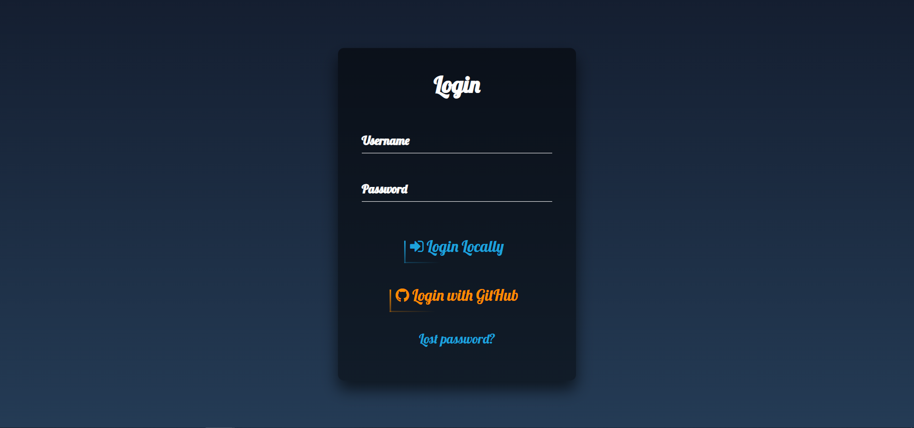
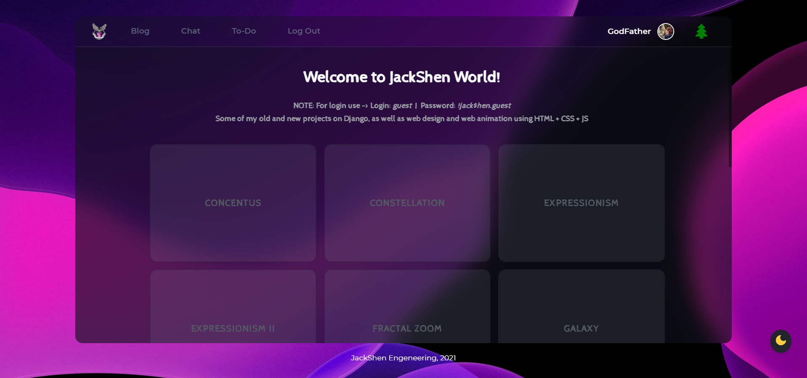
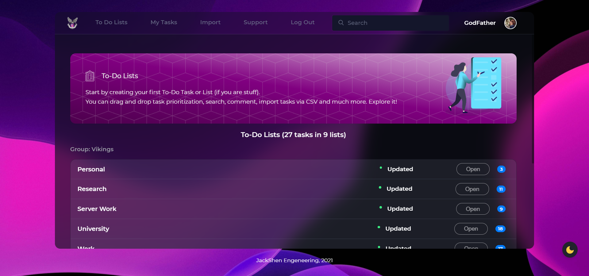
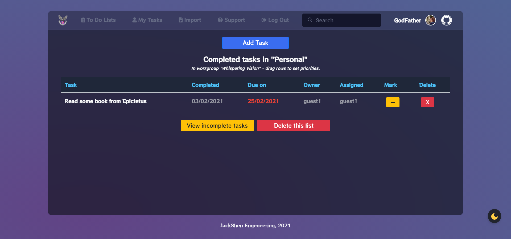
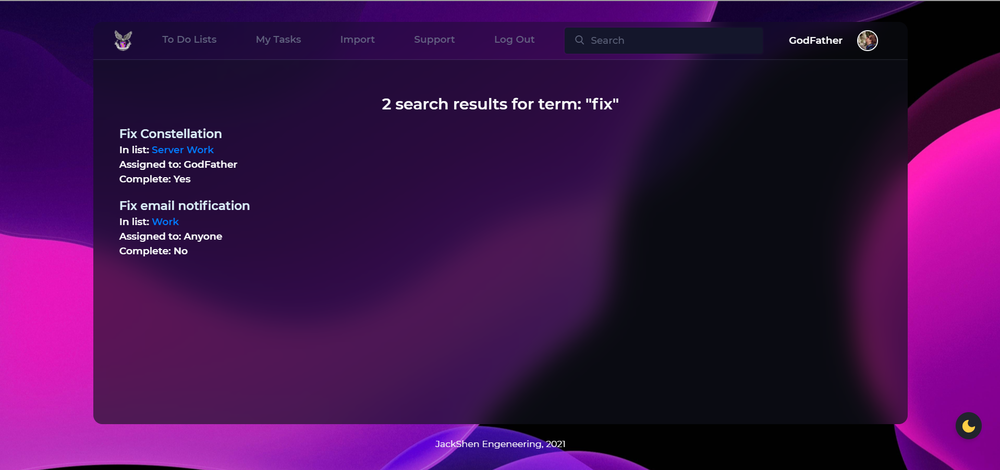
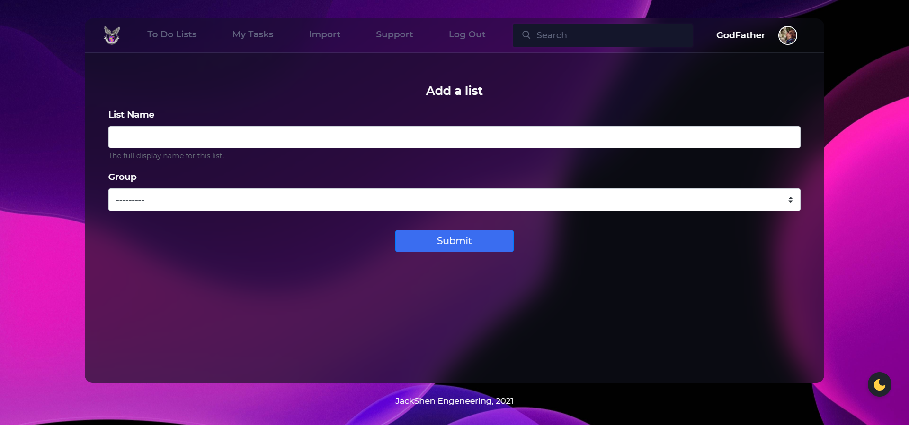
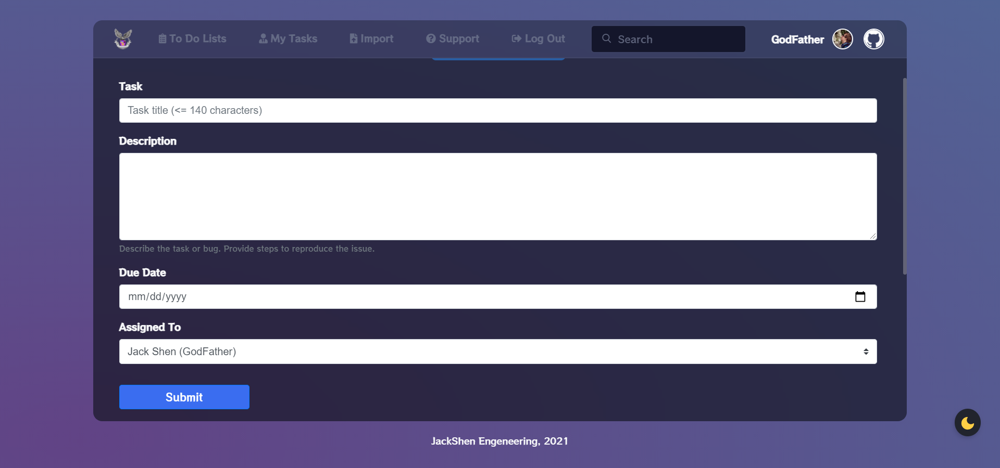
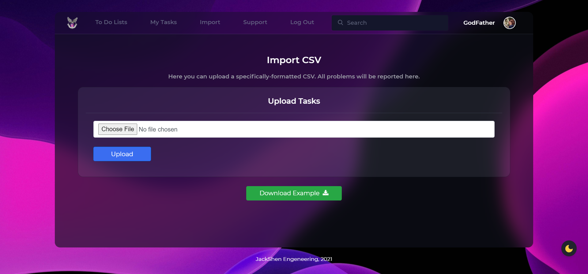

<h1 align="center"> JackShen World</h1>

  

 
This project is my portfolio and contains a variety of projects in which I learned the fun sides and possibilities of JavaScript, as well as a couple of projects in which I learned how Django works. 

## 🗃 &nbsp;Portfolio
The home page of my site contains my projects in which I studied the features of JavaScript and its libraries such as `p5.js`, `three.js`, `gsap.js` and others, there are also a couple of projects on pure CSS, including a project using `css-doodle`. When the time comes, I will write a full description of each project.

The site is also fully optimized for use on mobile phones.

### 📷 App Screenshots

Intro (My Logo SVG)         |  Login Page | Sign Up Page     |  User Page
:-------------------------:|:-------------------------:|:-------------------------:|:-------------------------:
 || |

Home Page (Dark Theme)         |  Home Page (Light Theme)   |  Project Example (Heartverse)     |  404 Page 
:-------------------------:|:-------------------------:|:-------------------------:|:-------------------------:
 || |

## 📋 &nbsp;To-Do App

This is a Django Web Application that helps you maintain a To-Do. It can be used as a personal tracker to do things or for a wider range of people, as the application is multi-user and multi-group. Users can belong to several groups, and each group can have several to-do lists. At least one group (configured in the Django administrator) must be created before starting, and this group must have at least one user as a member.

Users can view and edit all to-do lists belonging to their groups. Only staff users can add or delete lists. All tasks are created by the current user and can be assigned to a specific user. Unassigned tasks are displayed as belonging to anyone.

### ✨ &nbsp;Features

|                                         Feature                                         | Implementation |
|:---------------------------------------------------------------------------------------:|:--------------:|
| __Ability to make Joint Groups__ (To-Do can be seen and edited by several people) |        ✔️       |
| __Ability to make a Personal Group__ (only you can see your To-Do)                |        ✔️       |
| __Ability to view all Tasks I need to do__                                              |        ✔️       |
| __Ability to view all Completed Tasks__                                                 |        ✔️       |
| __Add, Edit, Delete To-Do's and To-Do Lists__                                           |        ✔️       |
| __Add, Delete Comments under Tasks__                                                    |        ✔️       |
| __Batch-Import and Export To-Do's in CSV Format__                                       |        ✔️       |
| __Drag&Drop To-Do Prioritization__                                                      |        ✔️       |
| __Fantastic UI__                                                                        |        ✔️       |
| __File Attachments to Task__ (сurrently only images are supported)                      |        ✔️       |
| __Login is essential to use the App__                                                   |        ✔️       |
| __Mobile-friendly__                                                                     |        ✔️       |
| __Register on the site__                                                                |        ✔️       |
| __Attach any files__                                                                    |        ❌       |
| __Email Notification__                                                                  |        ❌       |
| __Fix Support Page__ (messages are not sent)                                            |        ❌       |

### 📷 App Screenshots

To-Do Main Page         |  To-Do Tasks | Completed Tasks       |  To-Do Search
:-------------------------:|:-------------------------:|:-------------------------:|:-------------------------:
 || |

Add To-Do List         |  Add To-Do  | Import CSV       |  Help Center
:-------------------------:|:-------------------------:|:-------------------------:|:-------------------------:
 || |

## 📫 &nbsp;Get in touch

