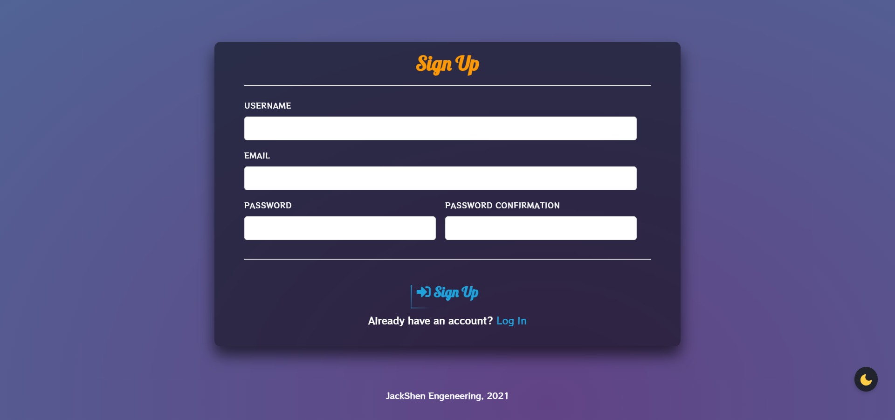
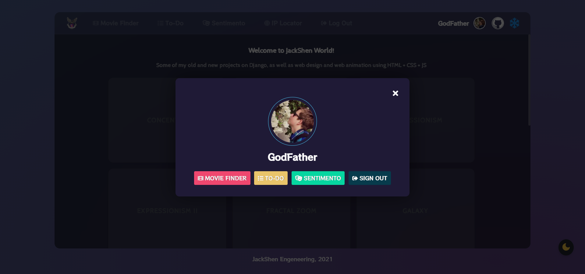
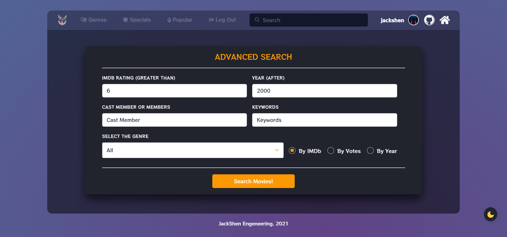
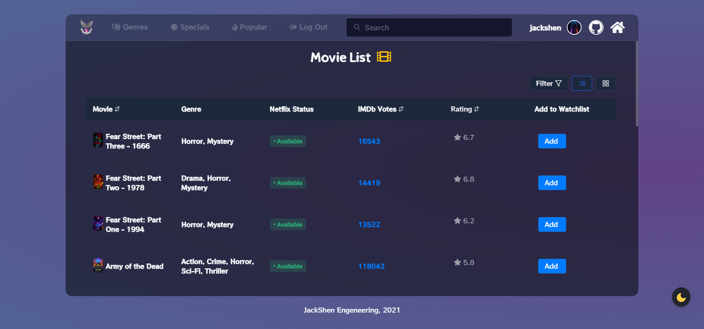
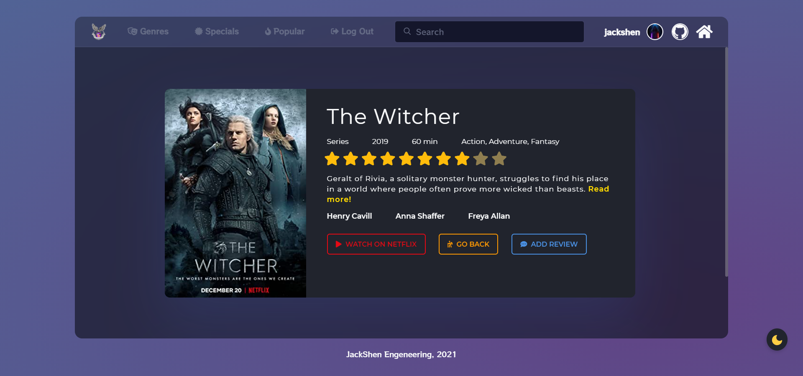
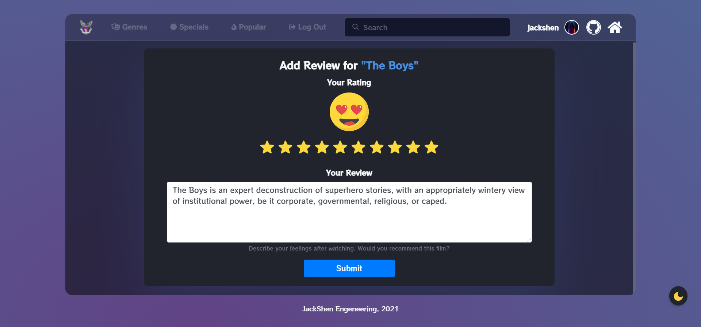
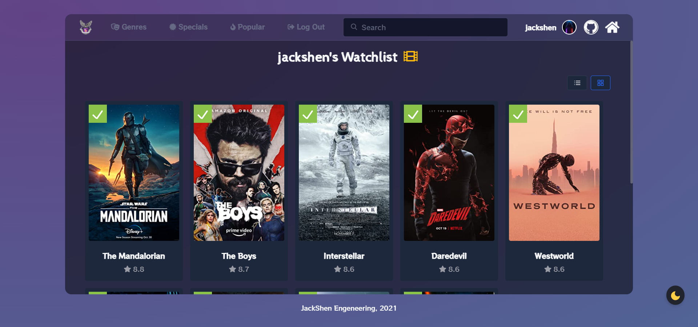
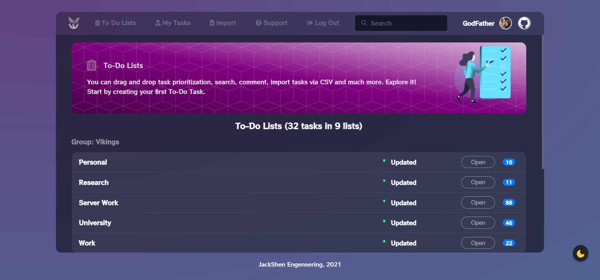
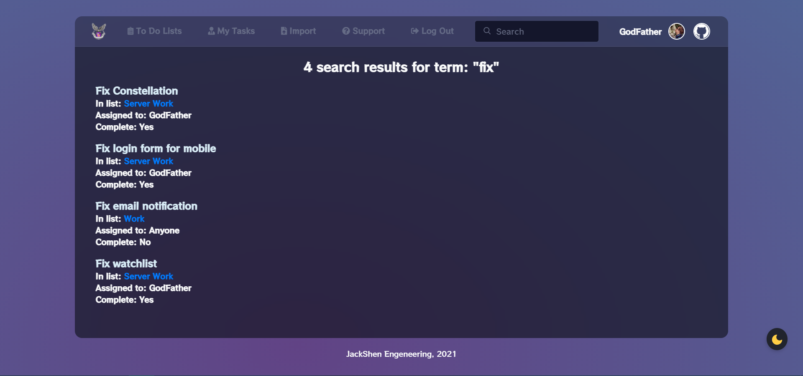
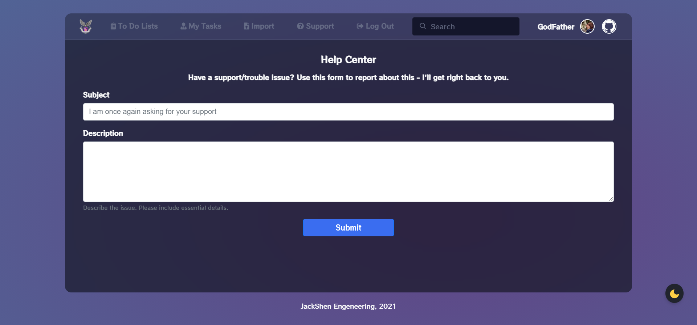

<h1 align="center"> JackShen World</h1>

<p align="center">
  
</p>

<div align="center"> 

This project is my portfolio, a project in Django that contains my other projects such as **Movie Finder**, **Sentimento** *(Sentiment Analysis App)*, or **To-Do** App. There are also a variety of projects in which I learned the fun sides and possibilities of JavaScript and links to the GitHub pages with descriptions of my projects not related to web development.
</div>

## 🗃 &nbsp;Portfolio
The home page of my site contains my projects in which I studied the features of JavaScript and its libraries such as `p5.js`, `three.js`, `gsap.js` and others, there are also a couple of projects on pure CSS, including a project using `css-doodle`. When the time comes, I will write a full description of each project.

The site is also fully optimized for use on mobile phones.

### 🚀 &nbsp;How to Run

1. Clone this repository;
2. Make sure that you have all the above requirements or do the following:
	1. cd to the directory where requirements.txt is located;
	2. activate your virtualenv;
	3. run: `pip install -r requirements.txt` in your shell.
3. Enter these commands in the console:

    ```shell
    >> python manage.py makemigrations
    >> python manage.py migrate
    >> python manage.py createsuperuser
    >> python manage.py runserver
    ```
    
4. Wait until the server starts and everything is ready!

### 📷 App Screenshots

Intro (My Logo SVG)         |  Login Page | Sign Up Page     |  User Page
:-------------------------:|:-------------------------:|:-------------------------:|:-------------------------:
 || |

Home Page (Dark Theme)         |  Home Page (Light Theme)   |  Project Example (Heartverse)     |  404 Page 
:-------------------------:|:-------------------------:|:-------------------------:|:-------------------------:
 || |


## 🎞️ &nbsp;Movie Finder App

This Django project is designed to search for movies, and in the future to receive recommendations through the neural network.

The user can search for movies by advanced search (rating, actors, keywords, years) or simply by title. In the "Specials" category you can see a list of Netflix movies, TOP-100 movies or a list of popular series. There is also a category of new popular movies.

When you go to some pages of movies or TV series (for example, "The Witcher"), you can see a short intro to the TV series or movie (videos are pulled from YouTube).

A registered user can add reviews to movies, rate them and add movies to the watchlist.

### 📝 &nbsp;Requirements

- **Django** (`v3.1+`)
- **Python** (`v3.8+`)
- **pandas** (`v1.3.0+`)
- **Gunicorn** (`v19.6+`)
- **django-heroku** (`v0.3.1`)
- **django-extensions** (`v3.0.5`)
- **dj_database_url** (`v0.5.0`)
- **psycopg2** (`v2.8.6`)
- **python-decouple** (`v3.4`)
- **whitenoise** (`v5.2.0`)

### ✨ &nbsp;Features

|                                        FEATURE                                       | IMPLEMENTATION |
|:------------------------------------------------------------------------------------:|:--------------:|
| __Search movies by title__                                                               | ✔️              |
| __Advanced movie search__ (_by rating, genre, keywords, year, cast_)                       | ✔️              |
| __Add/update/delete reviews__                                                            | ✔️              |
| __Add/remove movies from the watchlist__                                                 | ✔️              |
| __View all reviews__ (_admin only_)                                                        | ✔️              |
| __Browse a list of popular movies__                                                      | ✔️              |
| __Browse the list of movies by selected genre__                                          | ✔️              |
| __Browse the list of movies by special categories__ (_TOP-100, Netflix movies, TV series_) | ✔️              |
| __Excellent UI + optimization for smartphones__                                          | ✔️              |
| __Ability to login/register__                                                            | ✔️              |
| __Add recommendations based on the neural network__                                      | ❌              |
| __Add rewards to users__                                                                 | ❌              |
| __Add a chat__                                                                           | ❌              |

### 📷 App Screenshots

Advanced Search         |  User Profile | Movies List (Grid View)       |  Movies List (List View)
:-------------------------:|:-------------------------:|:-------------------------:|:-------------------------:
 || |


Movie Page         |  Movie Intro  | Genres Page      |  Special Categories
:-------------------------:|:-------------------------:|:-------------------------:|:-------------------------:
 || |


Review Form         |  Movie Reviews  | My Reviews       |  My Watchlist
:-------------------------:|:-------------------------:|:-------------------------:|:-------------------------:
 || |


### 💡 &nbsp;Additional Info

Movies are loaded to the database from the `.csv` file, which is located in Google Sheets. Therefore, the settings have a constant `SHEET_ID`, which contains the id of this table. This id is used in the `movies_load.py`, this script reads the whole table and if some data from the table is not in our database, it adds them there.

To add data to the `.csv` format table, another script is used - `movie_parser.py`. You can find it in [this repository](https://github.com/JackShen1/movie-finder/tree/main/scripts). There you will also need a OMDB API key. An example of the table is also in [this repository](https://github.com/JackShen1/movie-finder).

## 📋 &nbsp;To-Do App

This is a Django Web Application that helps you maintain a To-Do. It can be used as a personal tracker to do things or for a wider range of people, as the application is multi-user and multi-group. Users can belong to several groups, and each group can have several to-do lists. At least one group (configured in the Django administrator) must be created before starting, and this group must have at least one user as a member.

Users can view and edit all to-do lists belonging to their groups. 

To create a group, go to the admin tab, then select the **Groups** tab, then press **New**. To add a user to the group, go to the **Users** tab, go to your user and assign him a group.

In this application only admins (or staff users) can add or delete lists. Tasks in lists can be created by anyone, if an unregistered user is provided with a link to the list from admin. Tasks can be assigned to a specific user. Unassigned tasks are displayed as belonging to anyone.

### 📝 &nbsp;Requirements

- **Django** (`v3.1+`)
- **Python** (`v3.8+`)
- **Gunicorn** (`v19.6+`)
- **bleach** (`v3.0.2`)
- **django-heroku** (`v0.3.1`)
- **dj_database_url** (`v0.5.0`)
- **psycopg2** (`v2.8.6`)
- **python-decouple** (`v3.4`)
- **whitenoise** (`v5.2.0`)


### ✨ &nbsp;Features

|                                         FEATURE                                        | IMPLEMENTATION |
|:---------------------------------------------------------------------------------------:|:--------------:|
| __Ability to make Joint Groups__ (_To-Do can be seen and edited by several people_) |        ✔️       |
| __Ability to make a Personal Group__ (_only you can see your To-Do_)                |        ✔️       |
| __Ability to view all Tasks I need to do__                                              |        ✔️       |
| __Ability to view all Completed Tasks__                                                 |        ✔️       |
| __Add, Edit, Delete To-Do's and To-Do Lists__                                           |        ✔️       |
| __Add, Delete Comments under Tasks__                                                    |        ✔️       |
| __Batch-Import and Export To-Do's in CSV Format__                                       |        ✔️       |
| __Drag&Drop To-Do Prioritization__                                                      |        ✔️       |
| __Fantastic UI__                                                                        |        ✔️       |
| __File Attachments to Task__ (_сurrently only images are supported_)                      |        ✔️       |
| __Login is essential to use the App__                                                   |        ✔️       |
| __Mobile-friendly__                                                                     |        ✔️       |
| __Register on the site__                                                                |        ✔️       |
| __Attach any files__                                                                    |        ❌       |
| __Email Notification__                                                                  |        ❌       |
| __Fix Support Page__ (_messages are not sent_)                                            |        ❌       |


### 📷 App Screenshots

To-Do Main Page         |  To-Do Tasks | Completed Tasks       |  To-Do Search
:-------------------------:|:-------------------------:|:-------------------------:|:-------------------------:
 || |


Add To-Do List         |  Add To-Do  | Import CSV       |  Help Center
:-------------------------:|:-------------------------:|:-------------------------:|:-------------------------:
 || |


### 💡 &nbsp;Additional Info

he settings contain a couple of important config variables, let's look at their purpose.

**`TODO_ALLOW_FILE_ATTACHMENTS`** - if `True`, you can upload documents, otherwise no;

**`TODO_ALLOWED_FILE_ATTACHMENTS`** - contains a list of file extensions that can be uploaded on the server;

**`MAXIMUM_ATTACHMENT_SIZE`** - the maximum file size that can be uploaded (in bytes);

**`MAXIMUM_ATTACHMENT_FILES`** - the maximum number of files that can be added to one personal page;

**`TODO_STAFF_ONLY`** - if `True`, then only the admin with the mark **staff** will be able to perform the functions of a normal administrator, in turn, a normal administrator is equated to the user.

**NOTE:** these config variables need to be changed in the file **`defaults.py`** and in the **`settings.py`**.

🔥 To deploy the project on **Heroku**, read [this wonderful article](https://developer.mozilla.org/en-US/docs/Learn/Server-side/Django/Deployment).

## 📫 &nbsp;Get in touch

<p align="center">
<a href="https://www.linkedin.com/in/yevhenii-shendrikov-6795291b8/"></a>
<a href="mailto:jackshendrikov@gmail.com"></a>
<a href="https://www.facebook.com/jack.shendrikov"></a>
<a href="https://t.me/jackshen"></a>
</p>